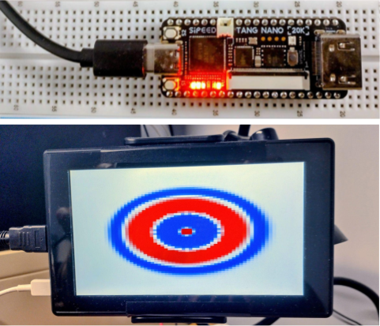

# FDTD in Verilog for FPGA

This repository contains the Verilog code accompanying the **_Multiphysics FDTD Simulations_** book, specifically the **GOWIN FPGA** section.

The repository provides two implementations of a 2D FDTD solver:

  

## Implementations

### 1. LED Output

A simple FPGA implementation that computes the electromagnetic field in a 2D PEC domain and outputs the electric-field value at the centre of the computational domain to the onboard LEDs.

This version is intended for basic FPGA testing and verification of the FDTD implementation.

### 2. HDMI/LCD Visualisation

A more advanced implementation that renders the simulated electric field directly on a Raspberry Pi LCD display through the FPGA's built-in HDMI interface.

This version provides real-time visualisation of the field evolution and is intended to demonstrate the FDTD solver operating directly on FPGA hardware.

## Hardware

- GOWIN FPGA development board
- Raspberry Pi LCD display (for the visualisation version)
- HDMI cable

## Contents

The repository contains the Verilog source files, FPGA constraints and supporting files required to synthesise and test the FDTD implementations on the target GOWIN FPGA platform.

## Reference

The implementations accompany:

**_Multiphysics FDTD Simulations_**

The code is provided as a practical FPGA implementation of the FDTD methods discussed in the book. 

