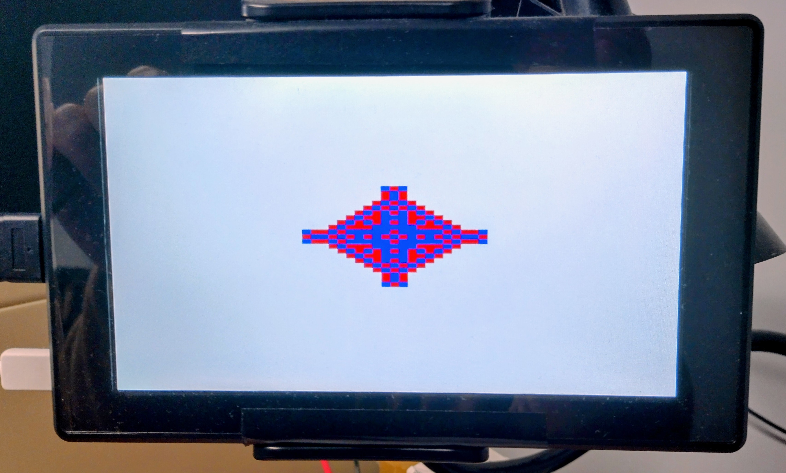

# Multiphysics FDTD Simulations

This repository contains the codes accompanying the book Multiphysics FDTD Simulations.

The picture shows the output of the FPGA implementation of the quantised FDTD algorithm described in the book.

  

